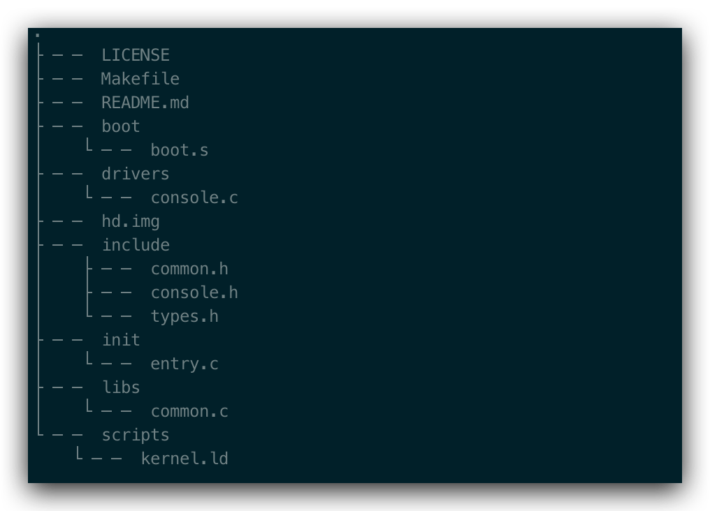
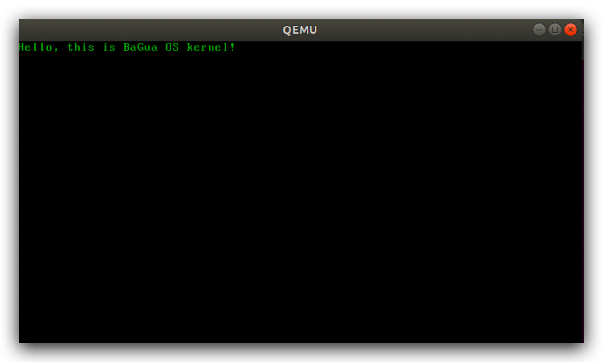
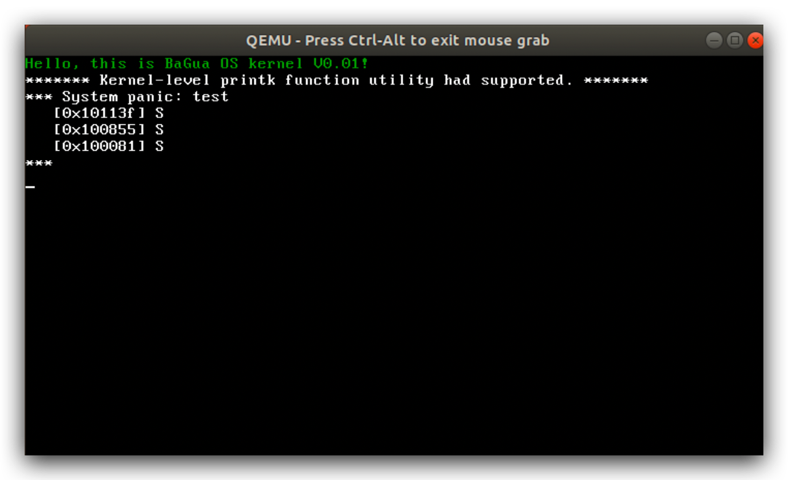
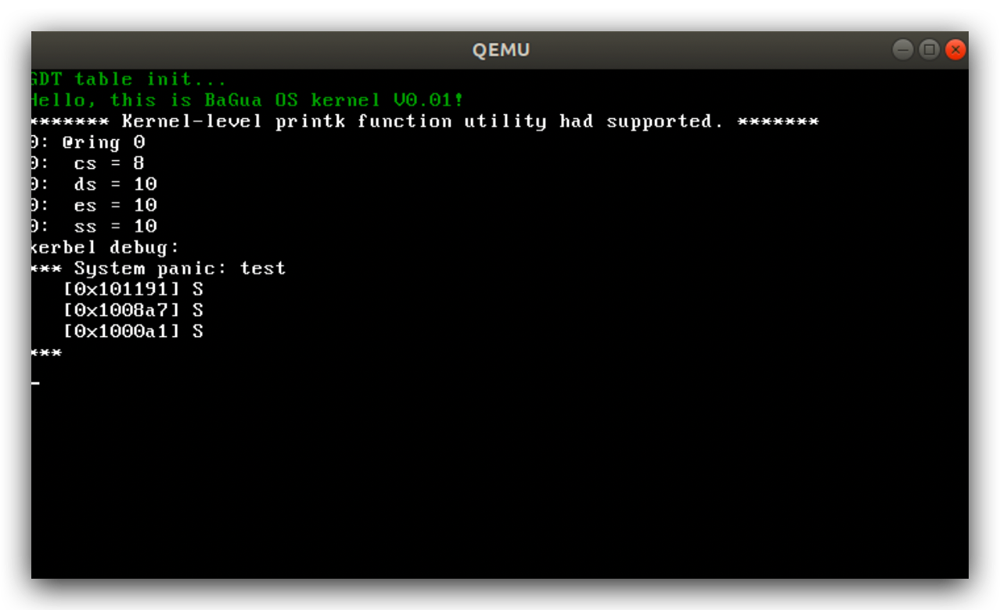

# BaGua

----

BaGua Operating system is aiming to focus on the future's needs, accelerating the world to be more flexible, warmable, believable.

八卦操作系统专注于未来世界的需求，加速⏩世界向更加有温度，可信任，灵活的，智慧的方向发展。


## 缘起

八卦源自中国传统文化中的一种阵法，名“八卦阵”。

> 太极生两仪，两仪生四象，四象生八卦。

如今，我用“八卦”这一词来命名刚刚出世的操作系统-BaGua Opreating System，象征着奥妙无穷，千变万化，散发着智慧的光芒。操作系统从最初的鼻祖Unix开枝散叶，相继诞生了Dos，Linux，Window，MacOS，Android，IOS等一大批有特色的系统，它们各具特色。伴随着场景的演化，系统也越来约复杂，在一些场景下，有的功能显得多余可以去掉，从而提升性能，有的场景目前系统还满足不了特殊需求，定制化又伴随而来。

因此，“八卦”系统-BaGua Os诞生了，它不是为了通用而存在，它是为了未来的需求而存在，在随着需求的进化而逐渐演变。


## 诞生

第一个版本v0.00发布，支持一下特性：

- 多系统引导，支持Gnu multiboot/multiboot2协议
-  支持硬盘引导，软盘引导
- 32位工作模式
- 支持i386处理器
- 有内核功能函数
  - 键盘输入
  - 屏幕显示功能

它虽然小而简单，但作为地基基础框架搭建起来了，结构完整，地基牢固所以容易扩展。


## 目录结构图

- boot 系统引导目录

- init 初始化程序目录
-  libs 内核功能库函数
- drivers io操作功能
- scripts 编译以及链接运行脚本



另外，提供虚拟硬盘hd.img大小10M，供系统启动使用。


## 系统运行

由于是内核级系统的开发，因此选择虚拟机上进行运行和调试，虚拟机有很多：VmWare, virtualBox, Bochs, qemu等。

这里，我选择的是qemu+virtualBox。

1 进入目录

```shell
cd BaGua
```

2 运行make，生成虚拟磁盘文件和系统BaGua_OS

```shell
make
```

3 运行虚拟机，启动BaGua_OS

```shell
make qemu
```



## 版本更新

### V0.00 首发版本

### V0.01版本

这个版本添加内核级别调试相关功能函数

- debug 支持内核错误🙅‍♂️时打印一些重要‼️的信息
- printk 内核级显示函数支持
- 字符串操作的支持



## V0.02版本

- 增加全局描述符表的支持


