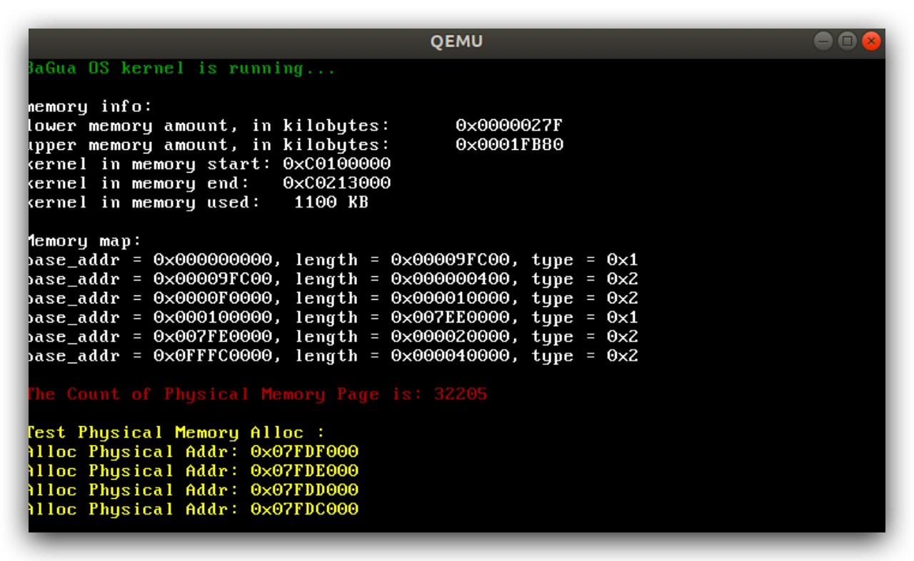
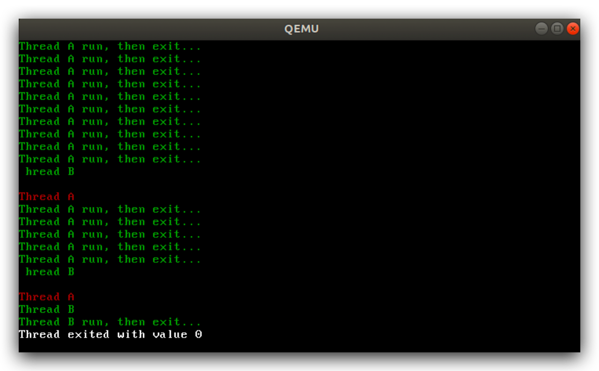
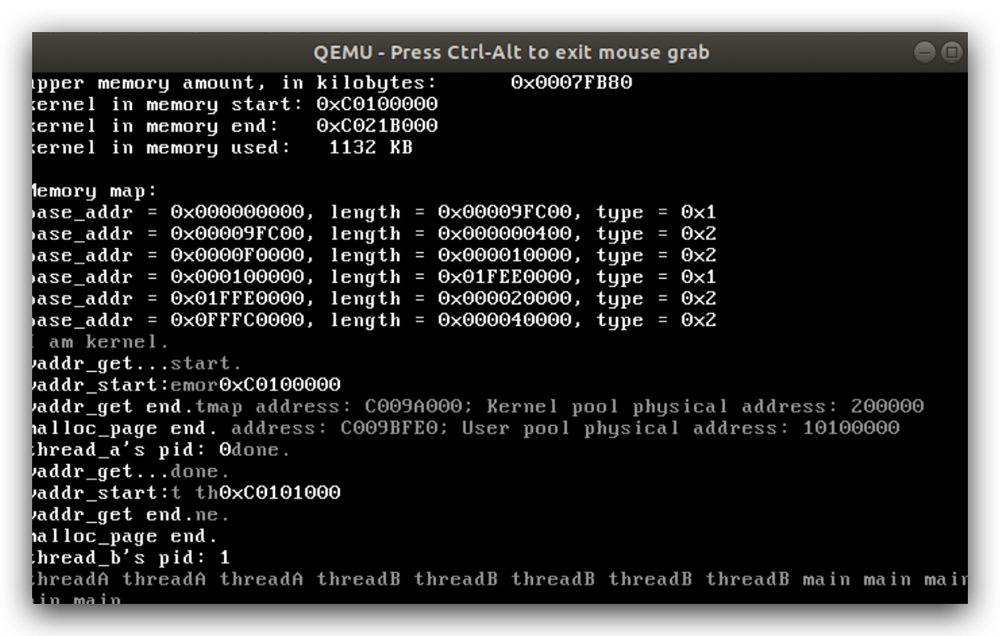

# BaGua

----

BaGua Operating system is aiming to focus on the future's needs, accelerating the world to be more flexible, warmable, believable.

八卦操作系统专注于未来世界的需求，加速⏩世界向更加有温度，可信任，灵活的，智慧的方向发展。


## 缘起

八卦源自中国传统文化中的一种阵法，名“八卦阵”。

> 太极生两仪，两仪生四象，四象生八卦。

如今，我用“八卦”这一词来命名刚刚出世的操作系统-BaGua Opreating System，象征着奥妙无穷，千变万化，散发着智慧的光芒。操作系统从最初的鼻祖Unix开枝散叶，相继诞生了Dos，Linux，Window，MacOS，Android，IOS等一大批有特色的系统，它们各具特色。伴随着场景的演化，系统也越来约复杂，在一些场景下，有的功能显得多余可以去掉，从而提升性能，有的场景目前系统还满足不了特殊需求，定制化又伴随而来。

因此，“八卦”系统-BaGua Os诞生了，它不是为了通用而存在，它是为了未来的需求而存在，在随着需求的进化而逐渐演变。


## 诞生

第一个版本v0.00发布，支持一下特性：

- 多系统引导，支持Gnu multiboot/multiboot2协议
-  支持硬盘引导，软盘引导
- 32位工作模式
- 支持i386处理器
- 有内核功能函数
  - 键盘输入
  - 屏幕显示功能

它虽然小而简单，但作为地基基础框架搭建起来了，结构完整，地基牢固所以容易扩展。


## 目录结构图

- boot 系统引导目录

- init 初始化程序目录
-  libs 内核功能库函数
- drivers io操作功能
- scripts 编译以及链接运行脚本

> 

另外，提供虚拟硬盘hd.img大小10M，供系统启动使用。


## 系统运行

由于是内核级系统的开发，因此选择虚拟机上进行运行和调试，虚拟机有很多：VmWare, virtualBox, Bochs, qemu等。

这里，我选择的是qemu+virtualBox。

1 进入目录

```shell
cd BaGua
```

2 运行make，生成虚拟磁盘文件和系统BaGua_OS

```shell
make
```

3 运行虚拟机，启动BaGua_OS

```shell
make qemu
```

> 

## 版本更新

### V0.00 首发版本

### V0.01版本

这个版本添加内核级别调试相关功能函数

- debug 支持内核错误🙅‍♂️时打印一些重要‼️的信息
- printk 内核级显示函数支持
- 字符串操作的支持

> 

## V0.02版本

- 增加全局描述符表的支持

> 

- 增加中断注册，中断请求服务框架
- 支持8259A芯片级联下的中断控制服务
- 定时器中断8243芯片的支持

> 

## V0.03版本

主要增加对内存的管理：

- 物理内存管理
  - 没有大程序频繁申请/释放内存的需求
  - 内存在开始使用时就为程序准备好
    - 能够避免程序因为内存频繁申请和释放造成对内核性能的影响
    - 优先保障程序的长期稳定运行
    - 保障程序运行的环境，可信，可靠

- 虚拟内存管理

- 分页模式的支持

  >
  >
  >

- 堆内存管理的支持
  - 满足小块内存的分配和释放，内存需求<4kb时
  - 双向链表实现

> 

## V0.04版本

- 增加内核进程/线程的统一表示，借鉴Linux风格
- 内核进程/线程的调度

> 


## V0.05版本

新版本特性，这期版本做了大量的修正工作，较上个版本改动大。主要体现在以下方面：

- 内存管理模块方面
  - 删除原来的基于栈内存分配和管理模式
  - 新增一个数据结构位图bitmap，用来表示内存的分配情况，配合内存管理模块
  - 新增基于bitmap的内存管理模块
    - 给出虚拟地址，能够自动判别是否分配，是否关联物理页
    - 能够分配物理页面，虚拟页面，并将二者通过页表进行映射
    - 内存的分配和释放通过bit位的状态

- 任务/内核线程模块
  - 大量改进原有进程/任务的数据结构，新增多个字段表示任务的状态
  - 在时间片轮转基础上新增优先级调度的支持
    - 初始化任务时对优先级设置的支持
  - 等待队列的实现
  - 线程切换机制，通过汇编实现支持
- 页表初始化设置方面
  - 改进原来的页表设置，方便访问管理
    - 内核和用户空间1:1划分
    - 第0项和第678项页目录项设置指向位0～4M的物理地址空间
    - 最后一个页目录项指向页目录表



## V0.06版本

目前内核还一直运行在内核，我们实现了内核多线程机制，内核多线程调度。

然而多线程操作，必然涉及到一个资源共享时操作的问题，即多个线程同时操作同一个资源会造成结果的不确定性，这是由于多个线程是通过分时来模拟的，1个CPU为多个线程提供服务，通过时钟中断在多个线程间来回切换。

那么，本次版本，我们要解决这个问题，经典的方法是同步机制，详细介绍：[同步机制实现](./docs/sync.md)

